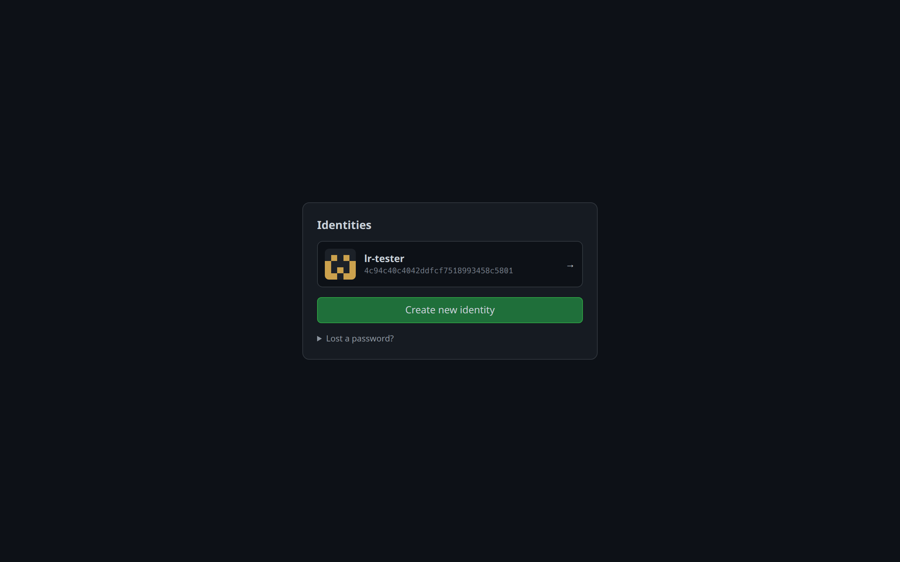
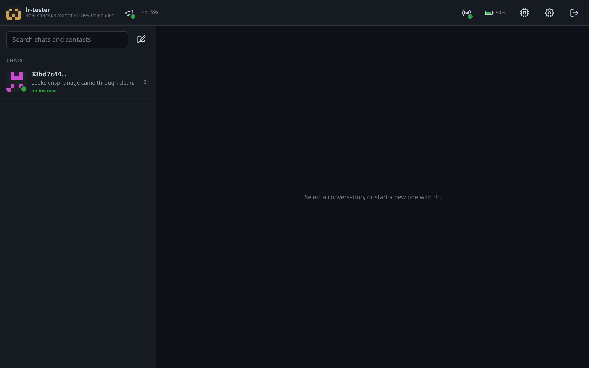
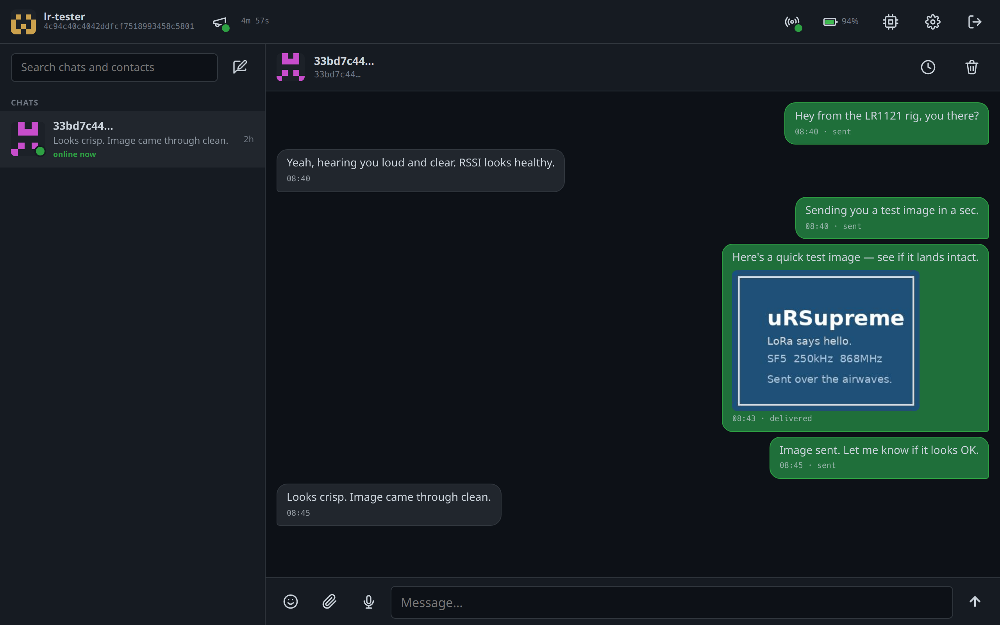
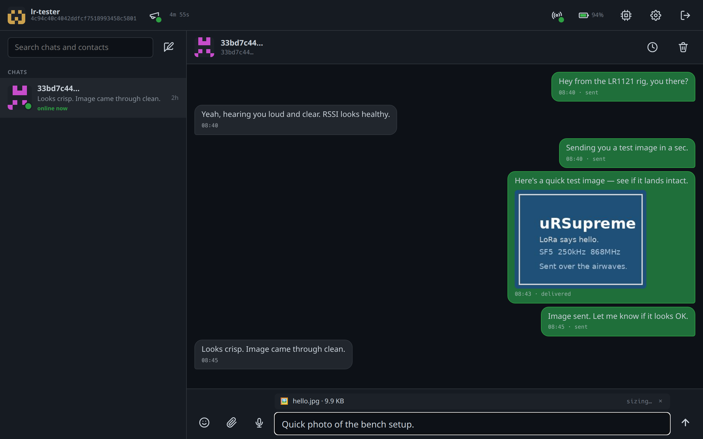
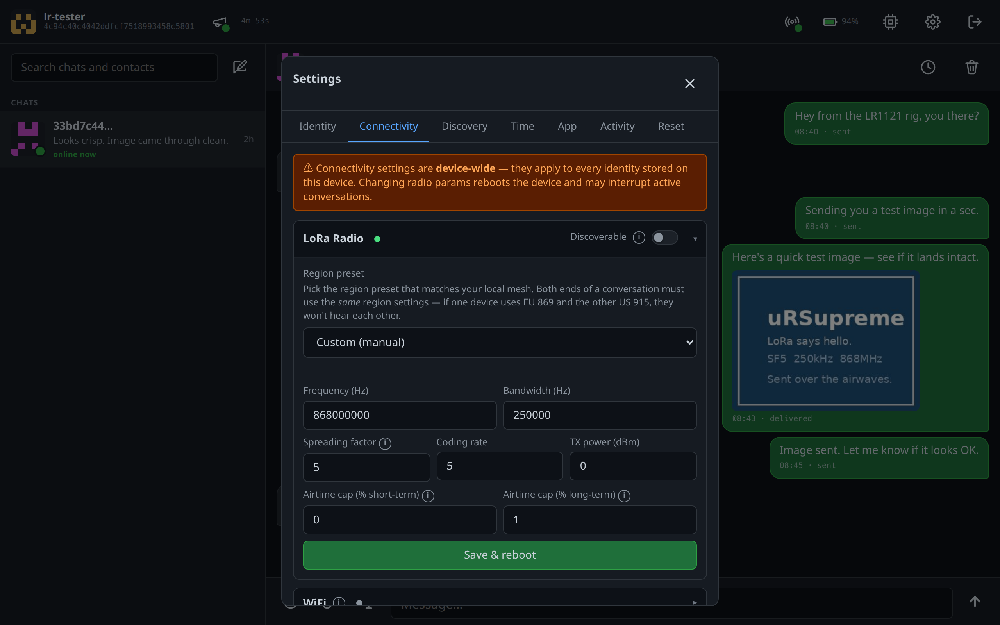
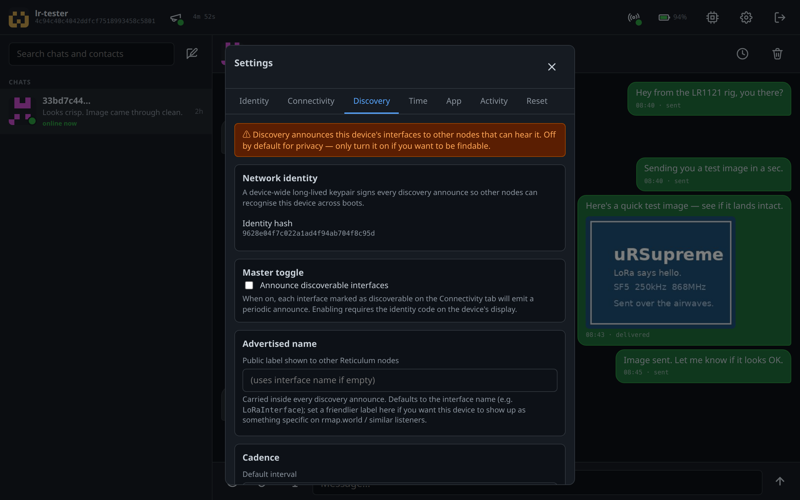
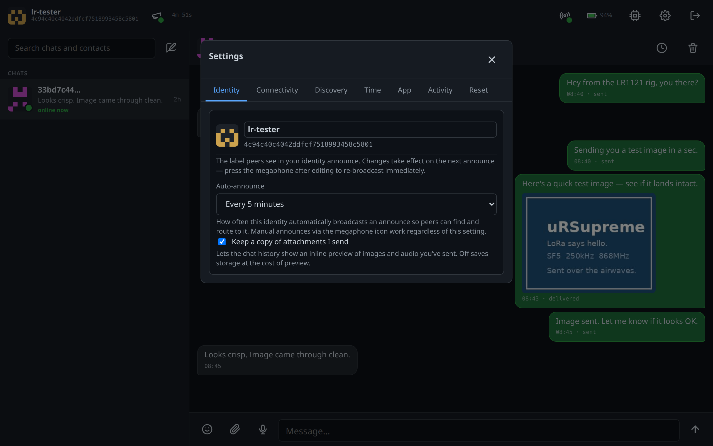
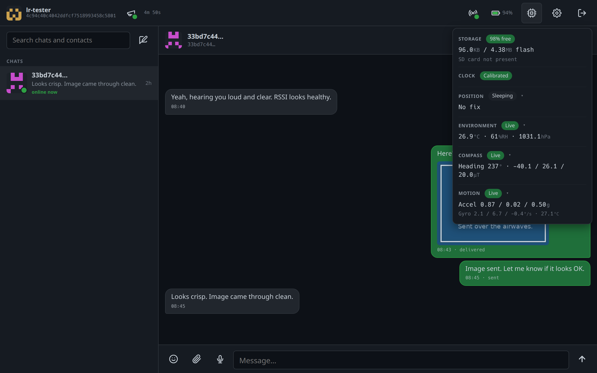

# μRSupreme

A Reticulum / LXMF node firmware focused on the **LilyGo T-Beam Supreme**
(ESP32-S3, 8 MB PSRAM, OLED, GPS, IMU, environmental sensors, AXP2101 power
management). It builds on
[microReticulum_Firmware](https://github.com/attermann/microReticulum_Firmware),
which integrates the
[microReticulum](https://github.com/attermann/microReticulum) stack into
[RNode_Firmware](https://github.com/markqvist/RNode_Firmware).

μRSupreme makes the T-Beam Supreme a standalone Reticulum node with a
built-in chat client. You reach it from any browser on the same network.
There's no host computer involved.

## Why this fork

μRSupreme exists to give the T-Beam Supreme a built-in user interface.
Upstream RNode firmware treats devices as KISS radios for an attached
host. Upstream microReticulum_Firmware adds the RNS stack and transport
routing on-device, but stops short of a UI. The Supreme has WiFi, so it
can host the web UI directly. Its sensor and GPS payload also make it
attractive as an all-in-one mesh communicator and telemetry device.

The web app runs LXMF chat with attachments. It supports multiple
identities, surfaces sensor and position telemetry, can publish
discovery announces for community-map listeners like
[rmap.world](https://rmap.world), and exposes a settings panel for the
radio and transport stack. Everything is served from the device over
WiFi.

## Screenshots

A walk through the web app on the LR1121 rig.

| | |
|:--:|:--:|
|  |  |
| Pick which identity to log in as. | Conversations the device has had, grouped by peer. |
|  |  |
| An in-progress chat including an inline image attachment. | Composing a message with a staged image. |
|  |  |
| Radio configuration: region preset, manual params, airtime caps. | rmap.world announce config and PoW stamp cost. |
|  |  |
| Per-identity prefs: display name, announce cadence, attachments. | Heap, PSRAM, channel utilisation, GPS, battery. |

## A note on AI assistance

Substantial portions of the code added in this fork have been written
with the help of AI tooling. That includes the web app, most of the
LXMF gateway code, the sensor / power / GPS / RTC integrations, the
build and release pipeline, and this README.

Some people object to using AI-generated code in projects they care
about, and that's a reasonable position. If that's you, this project
isn't the right tool for you. There are excellent alternatives in the
[Reticulum ecosystem](https://reticulum.network/).

I work this way because, without AI tooling, this project wouldn't
exist at all. Between work, family, and the rest of life, the time
budget for hobby firmware is small. AI assistance lets me build things
I'd otherwise never finish.

## Features

### Reticulum / LXMF on-device

- **Standalone RNS transport node.** Routes for other nodes without a
  host attached.
- **Multi-identity LXMF.** Up to 4 identities per device. Each has its
  own inbox, sent log, retention policy, display name, and announce
  schedule.
- **Attachments.** Send and receive images and audio inline in the
  chat UI. Images resize before send. Sends and receives show a
  progress bar.
- **Forward secrecy for LXMF.** In-flight messages still decrypt
  across key rotations.
- **Discovery announces with PoW stamps.** Default cost is 14
  leading-zero bits. Configurable in Settings → Discovery; set cost to
  0 to disable. Announces advertise the device's radio interfaces and
  region settings. When GPS has a lock, they also carry an approximate
  location for community listeners.

### Transports

- **LoRa** via SX1262 (Supreme SX1262) or LR1121 (Supreme LR1121).
  Region presets for EU, US, AU, NZ, RU, IN, KR. Full manual override
  for frequency, bandwidth, SF, coding rate, TX power, and airtime
  caps.
- **TCP client transport.** Outbound TCP links to other Reticulum
  nodes, for joining a remote network over the internet or a wired
  LAN bridge. Available on both Supreme variants.
- **WiFi.** Station mode with one saved network. If STA fails to
  connect for ~3 minutes at boot, the device brings up a recovery
  softAP. Runtime drops never expose the AP; only a reboot re-enters
  the recovery window.
- **Improv WiFi over USB-serial.** The
  [web flasher](https://benagricola.github.io/uRSupreme/) prompts for
  WiFi credentials right after flash, and the device joins without
  ever going through a softAP step. Already-flashed devices can also
  be re-configured this way without a re-flash.
- **BLE** for serial / KISS over Bluetooth Low Energy.

### Web app

- **Web chat client** at `http://<device>/`. Login per identity,
  conversation list, threaded view, compose with emoji picker, attach
  tray (camera capture, audio record, file pick), reactive unread /
  online / path-state indicators.
- **Identity switcher** for hopping between identities on the same
  device without re-logging-in.
- **Settings**:
  - *Identity*: display name, announce cadence, attachments on/off.
  - *Connectivity*: LoRa region and manual radio params, WiFi
    credentials, TCP clients, BLE, serial / KISS diagnostics.
  - *Discovery*: master toggle, advertised name, cadence, stamp cost.
  - *Telemetry*: which sensors to share, send cadence, and device-report
    collectors (push telemetry to fixed targets).
  - *Map*: tile source (offline SD or online), downloaded detail areas,
    and on-device region downloads.
  - *Time*: GPS / RTC / NTP / browser source priority, and the GPS
    clock-sync cadence.
  - *App*: UI prefs, per-chat retention defaults.
  - *Activity*: max send / receive size limits.
  - *Reset*: per-identity delete and factory reset.
- **Live status** in the top bar. Battery icon, radio status pill
  (online / offline / not-configured), and a system popover with LoRa
  channel utilisation (own vs others), RSSI vs noise floor, uptime,
  free heap and PSRAM, and the SD-migrate helper.
- **Auth.** Per-identity password (hashed on device). Identity-code
  gating for actions that require physical-presence proof, like WiFi
  reconfig or factory reset.

### Maps

- **Offline vector maps.** The web app shows a real map with no
  internet connection, rendered from vector tiles on the device's SD
  card. Maps need an SD card.
- **Build maps on the device.** Draw an area and the device pulls just
  that region from the global Protomaps planet over the internet, then
  serves it offline from then on. A coarse world base layer plus any
  number of downloaded detail areas combine into one map. The whole
  planet is far too large to mirror (about 127 GB), so you download
  only the regions you want.
- **Tracks.** A live-shared location grows a GPX track that renders on
  the map and as a thumbnail in the chat bubble, with a download. A
  `.gpx` file someone sends you renders the same way.
- **Two ways in.** Open the map from the top bar to see every peer's
  latest position, or open it from a location message to focus on that
  peer and their track.

### Sensors and telemetry

- **Battery** (AXP2101): voltage, charge / discharge current,
  percentage, charger state, USB-power detect.
- **Position** (L76K or MAX-M10 GPS, auto-detected): lat, lon,
  altitude, fix quality, HDOP, satellite count. Location power and
  clock sync are two separate controls now (see GPS power below). Used
  to tag discovery announces and, as a time source, to set the clock.
- **Clock** (PCF8563 hardware RTC): synced from GPS, NTP, or the
  browser. Source priority is set in Settings → Time.
- **Environment** (BME280): temperature, humidity, pressure, with a
  pressure trend.
- **Motion** (QMI8658 IMU): orientation and tilt.
- **Compass** (QMC6310): tilt-compensated heading, fused with the IMU,
  with on-device calibration that persists across reboots.
- **Telemetry sharing.** Attach your sensors (location, environment,
  battery, compass) to a message, or share them live with another
  device. A live share streams updates to the other side at the rate
  they ask for, and either side can stop it. A shared location can grow
  a track (see Maps). Separately, device-report collectors can push
  telemetry to one or more fixed targets on a schedule.

#### Sensor timing: live vs configured interval

Each sensor has a configured refresh interval. That interval is the
**idle** cadence: how often the sensor reads when nobody is looking.

Sensors refresh **live** (much faster) whenever they are actually being
watched:

- the sensor screen is open on the device's OLED, or
- the sensors popover is open in the web app, or
- another device holds a live share of that sensor.

When none of those is true, the sensor drops back to its configured
interval. So readings are instant while you watch or share them,
without polling the hardware (and spending power) the rest of the time.
Battery is always cheap to read. Location is the exception: it follows
the GPS power schedule below, not this live / idle rule.

#### GPS power: location updates vs clock sync

Location power and clock sync used to be one setting. They are now
independent:

- **Location updates** (the GPS section of the sensors popover): how
  often the receiver is awake producing fixes. **Always on** (the
  default) keeps it powered continuously. **Every 5 / 15 / 30 / 60
  min** duty-cycles it: after the first fix the receiver sleeps between
  fixes to save power and wakes to refresh.
- **Clock sync** (Settings → Time): how often a live fix may resync the
  clock. GPS here is just one time source, ranked against NTP and the
  browser. It is independent of how often location updates.

### On-device display (OLED)

- **Screen framework.** The OLED is a small app of its own: status,
  messenger, and sensor screens with a shared header, a nav hint, and a
  two-button gesture map (the POWER and BOOT keys).
- **Status** shows identity, radio, GPS, and battery at a glance.
- **Messenger** reads and sends short messages from the device itself.
- **Sensors** has a GPS screen that draws the real Earth as a globe
  with your position pinned and satellites in view, a tilt-compensated
  compass dial, and an environment screen. These screens refresh live
  while you are looking at them (see Sensor timing above).

### Storage

- **Optional SD card**: auto-detected. When present, attachments
  overflow to it. A migrate-from-flash helper lives in the system
  popover (the CPU icon in the top bar).
- **Per-chat retention**. Either forever, or bounded by N days or
  last N messages.

## Hardware

Both primary targets are ESP32-S3 with 8 MB PSRAM, shipped with the
full sensor and power-management complement (OLED, AXP2101, BME280,
QMI8658, QMC6310, L76K or MAX-M10 GPS, PCF8563):

- **LilyGo T-Beam Supreme SX1262.** PIO env `ttgo-t-beam-supreme`.
- **LilyGo T-Beam Supreme LR1121.** PIO env
  `ttgo-t-beam-supreme-lr1121`.

The codebase inherits microReticulum_Firmware's PIO envs for other
RNode-style boards (T-Beam classic, LilyGo T3-S3, T-Deck, Heltec
V2/V3/V4, RAK4631, NG-20/21, Lora32 variants, etc.). They should
still build, but only the Supreme gets day-to-day testing, the web
app, and the sensor integrations.

## Quick start

The fastest path is the in-browser flasher. Plug in the device and
click the button matching your variant:

### 👉 [benagricola.github.io/uRSupreme](https://benagricola.github.io/uRSupreme/)

Chromium-based browsers only (Chrome, Edge, Brave, Opera). The
flasher talks to the device over Web Serial. No toolchain or
terminal involved. After the firmware lands, the page asks you for
the WiFi network to join and hands you back the device's URL when
it's online.

### …or flash manually with esptool

If you'd rather drive `esptool` yourself, or your browser doesn't
ship Web Serial:

1. Plug your T-Beam Supreme into your computer over USB.
2. Install [esptool](https://docs.espressif.com/projects/esptool/):
   ```sh
   pipx install esptool       # or: pip install --user esptool
   ```
3. Grab the latest release from the
   [Releases page](https://github.com/benagricola/uRSupreme/releases).
   You need the `.factory.bin` for your variant:
   - **Supreme SX1262** → `urSupreme-sx1262-<version>.factory.bin`
   - **Supreme LR1121** → `urSupreme-lr1121-<version>.factory.bin`
4. Find the USB port:
   - Linux: `/dev/ttyACM0` (or `ACM1`, …)
   - macOS: `/dev/cu.usbmodemXXXXXX`
   - Windows: `COM3` (or higher; check Device Manager)
5. Flash:
   ```sh
   esptool.py --chip esp32s3 -p /dev/ttyACM0 write-flash 0x0 urSupreme-sx1262-<version>.factory.bin
   ```

For an OTA-style upgrade where the device already runs μRSupreme,
download the `.bin` (without `.factory`) and flash it at offset
`0x10000` instead.

### First boot (manual flash)

The device comes up in **softAP mode** with SSID `RNode XXXX` (four
hex chars from the BT MAC, also shown on the OLED). Join that
network, open `http://10.0.0.1/`, and walk through the first-run
setup: pick a region preset, set a password, join your home WiFi.

Subsequent boots auto-join WiFi. Reach the device via mDNS at
`http://rnodexxxx.local/` (same four hex chars, lowercase), or by
the IP shown on the OLED.

If you used the web flasher, the WiFi handshake already happened
over USB-serial and you can skip the softAP step entirely.

## Developer setup

For building from source.

1. Install [PlatformIO](https://platformio.org) (CLI or VS Code
   extension).
2. Clone this repo and its sibling dependencies into the **same
   parent directory**. The build expects `microReticulum` and
   `microStore` on the matching `ur-patches` branches to sit next to
   `uRSupreme`:
   ```sh
   mkdir uRSupreme-build && cd uRSupreme-build
   git clone git@github.com:benagricola/uRSupreme.git
   git clone -b ur-patches git@github.com:benagricola/microReticulum.git
   git clone -b ur-patches git@github.com:benagricola/microStore.git
   cd uRSupreme
   ```
3. Build and flash the variant matching your device, plugged in over
   USB:
   ```sh
   pio run -e ttgo-t-beam-supreme-lr1121 -t upload --upload-port /dev/ttyACM0
   # or, for the SX1262 Supreme:
   pio run -e ttgo-t-beam-supreme        -t upload --upload-port /dev/ttyACM0
   ```

`master` carries the most recent work. Tagged releases (`v*`)
trigger the CI that publishes the `.factory.bin` artefacts the
Quick start section uses.

## Status and caveats

- This is a **fork for personal use** as much as it is a published
  project. Things change quickly. The `master` branch is what runs
  on the test rig.
- Only one WiFi network can be saved at a time. Configuring a new
  one replaces it.
- Stamp PoW is on by default (cost 14). Disabling it (cost 0 in
  Settings → Discovery) will cause strict listeners like rmap.world
  to drop the announce.
- GPS pulsed power-save (location updates set to 5 min or longer) is
  new. The duty-cycle and wake logic are verified indoors; the warm
  re-acquire after a power-save sleep is still being checked outdoors.
  Always on is the default and is unaffected.
- Maps need an SD card, and building a region downloads it from the
  internet once before it works offline.
- The non-Supreme build envs are inherited from upstream and are not
  routinely tested here. If something on a non-Supreme board breaks,
  please open an issue, but expect a slower turnaround than for
  Supreme bugs.

## Credits

- **Mark Qvist**: [Reticulum](https://github.com/markqvist/Reticulum)
  and [RNode_Firmware](https://github.com/markqvist/RNode_Firmware).
- **Aaron Attermann**:
  [microReticulum](https://github.com/attermann/microReticulum) and
  [microReticulum_Firmware](https://github.com/attermann/microReticulum_Firmware),
  on which this fork is built.
- **LilyGo / Lewis He**: hardware and the
  [SensorLib](https://github.com/lewisxhe/SensorLib) and
  [XPowersLib](https://github.com/lewisxhe/XPowersLib) drivers for
  the T-Beam Supreme peripherals.
- **Adafruit**: BME280, SH110X, and Unified Sensor libraries.
- **ESP32Async**: the maintained
  [AsyncTCP](https://github.com/ESP32Async/AsyncTCP) and
  [ESPAsyncWebServer](https://github.com/ESP32Async/ESPAsyncWebServer)
  forks that the web stack relies on.
- **Benoit Blanchon**:
  [ArduinoJson](https://github.com/bblanchon/ArduinoJson).
- **Hideaki Tai**:
  [MsgPack for Arduino](https://github.com/hideakitai/MsgPack).

## Licence

μRSupreme as a whole is published under GPL-3.0 (see [LICENSE](LICENSE)).
The fork inherits the licence from microReticulum_Firmware, which in
turn inherits it from RNode_Firmware.

Individual upstream libraries that the build links in keep their own
licences (MIT, BSD-2-Clause, Apache-2.0, and LGPL-3.0 between them).
Anyone reusing a specific file or library extracted from this project
is bound by that file's original licence, not by GPL-3.0. The full
inventory, including notes on GPL-3.0 compatibility and how to add new
dependencies, is in [THIRD_PARTY_LICENSES.md](THIRD_PARTY_LICENSES.md).
